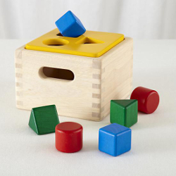

ShapeSorter
===========



**This is a proof of concept and a work in progress**

ShapeSorter is a small cast combinators library for Scala. By "cast" I mean
any function conceptually equivalent to `Any => Option[T]` just like
`any.asInstanceOf[T]` but safer (unless you want to go unsafe).

The keystone abstraction at the core of this library is the trait `Cast[T]`,
that can represent a cast as complex as needed or, as simple as a plain cast:

```scala
scala> import org.refeed.shapesorter._
import org.refeed.shapesorter._

scala> val asString = Cast.to[String]
asString: org.refeed.shapesorter.Cast[String] =
org.refeed.shapesorter.SimpleCast@7a20a0ec

scala> asString.cast("hello")
res0: org.refeed.shapesorter.Cast.Result[String] = \/-(hello)

scala> asString.cast(42)
res1: org.refeed.shapesorter.Cast.Result[String] = -\/(Error(cannot cast
java.lang.Integer to java.lang.String,42,List()))
```

